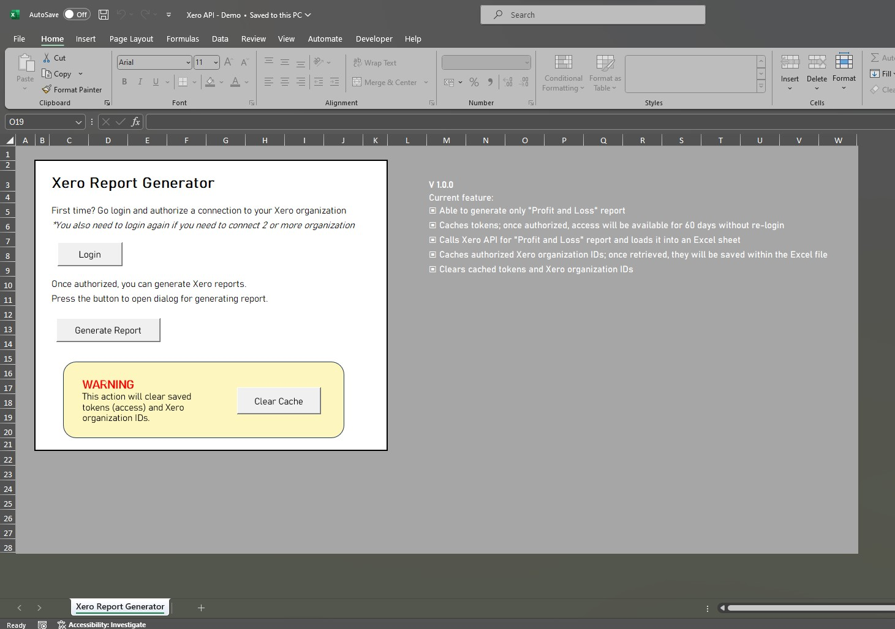
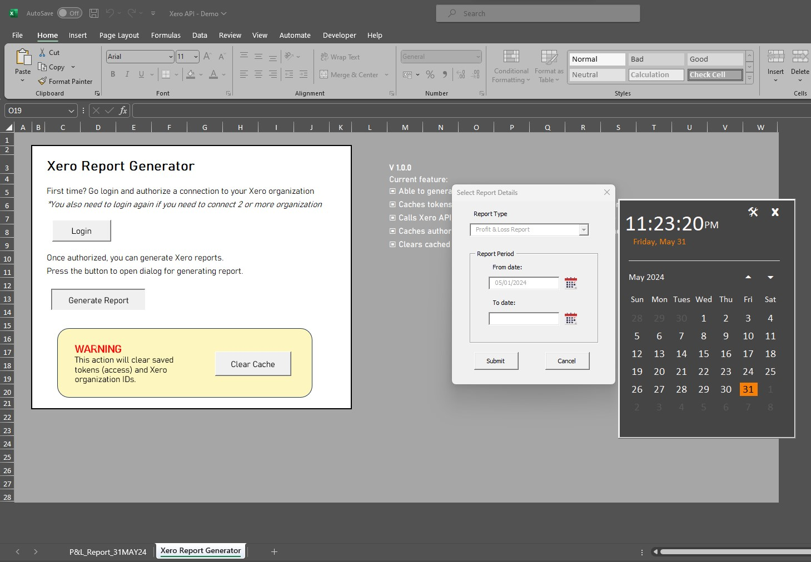
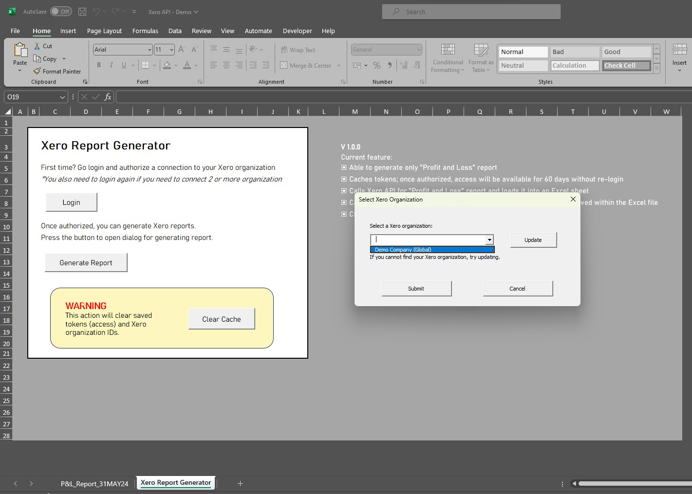
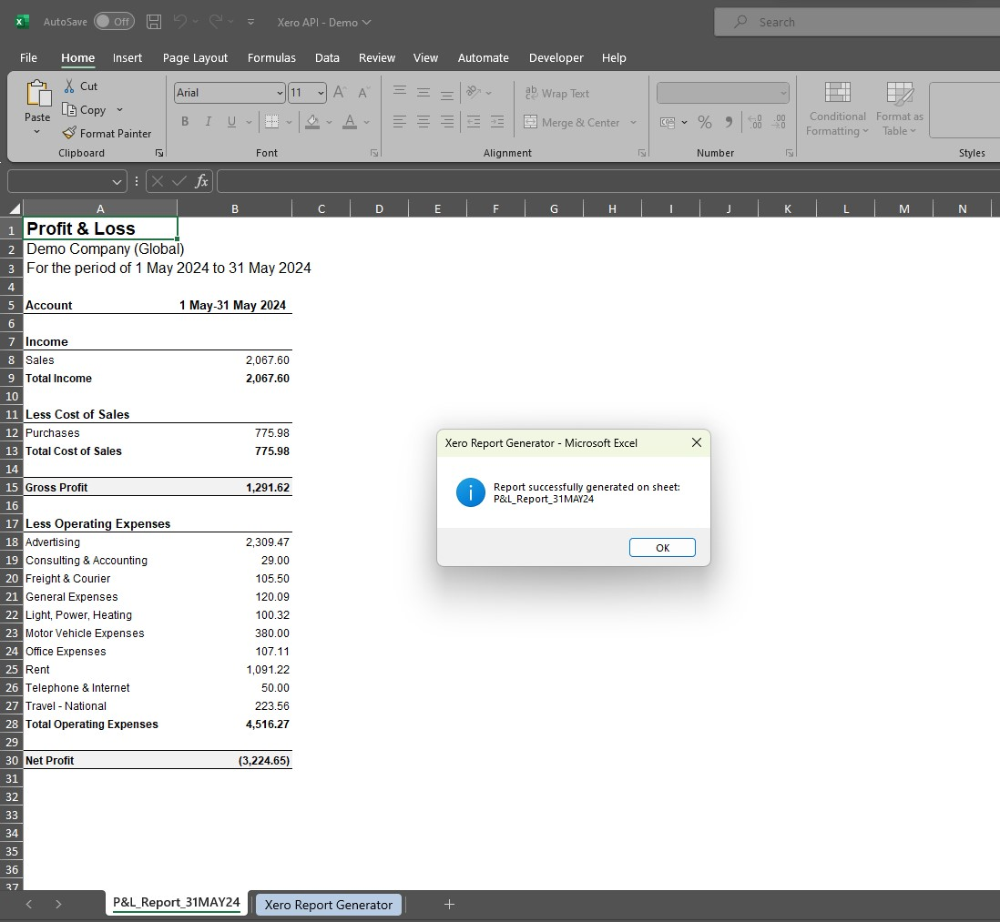

<!-- PROJECT SHIELDS -->
<!--
*** I'm using markdown "reference style" links for readability.
*** Reference links are enclosed in brackets [ ] instead of parentheses ( ).
*** See the bottom of this document for the declaration of the reference variables
*** for contributors-url, forks-url, etc. This is an optional, concise syntax you may use.
*** https://www.markdownguide.org/basic-syntax/#reference-style-links
-->

 

<h1 align="center">vba-xero-api</h1>

  

    Interacting with Xero API through VBA (Microsoft Excel) 
  
  
    You can watch the project demo video on YouTube by clicking the image below:
     
     
  

## About The Project

This VBA script allows access and interaction with the Xero API through Microsoft Excel.
It handles the authentication process (OAuth2) and the interactions with the API.

v1.0.0 current features:
- Handles Xero authentication (OAuth2) flows: [Xero Auth Flow](https://developer.xero.com/documentation/guides/oauth2/auth-flow/)
- Generates "Profit and Loss" report
- Caches tokens; once authorized, access will be available for 60 days without re-login
- Calls the Xero API for Profit and Loss report and loads it into an Excel sheet
- Caches authorized Xero organization IDs; once retrieved, they will be saved within the Excel file
- Clears cached tokens and Xero organization IDs

I have written a step-by-step guide explaining how I implemented the authentication flow for this project.  
You can check it out in [this Medium article](https://medium.com/@musayohanes00/navigating-oauth2-authentication-in-vba-3ba524c85171)!

(<a href="#readme-top">back to top</a>)

## Problem and Solution

The Xero API has robust authentication, applying the industry-standard OAuth2, which is quite complex.  
As finance and accounting generally perform analyses inside Microsoft Excel, there is a need for integration.  

VBA lacks support for implementing this authentication, making it a challenge.  
For example, part of the auth flow requires a browser for user login, while the only VBA built-in browser (Internet Explorer) has been deprecated since 2022.  

Thanks to the community and their open-source projects, alternatives can be implemented.  
I decided to make this project public as a significant part of it works due to open-source projects.  
Hopefully, it will help anyone looking for VBA solutions related to API and OAuth2, just like me.  

(<a href="#readme-top">back to top</a>)

## Building Blocks and Credits

This project was built in the **VBA 7.1** programming language.
It was made possible thanks to open-source modules/packages:
- [VBA-Web](https://github.com/VBA-tools/VBA-Web) by Tim Hall
- [Chromium Automation with CDP for VBA](https://github.com/longvh211/Chromium-Automation-with-CDP-for-VBA) by ChrisK23 & Long Vh
- [Calendar Input Form in Excel VBA](https://stackoverflow.com/questions/54650417/how-can-i-create-a-calendar-input-in-vba-excel) by Siddharth Rout & logicworkz

(<a href="#readme-top">back to top</a>)

## Getting Started

How to get started using the scripts:
1. Download the [`Xero API - Demo.xlsm`](XeroAPI-Demo.xlsm) file.
2. It contains all of the modules & forms inside [`exported_source_code`](exported_source_code) and a sheet with a simple user interface.
3. The interface provides users with options to:  
   - **Login**: call out the browser to have the user log in to the Xero page
   - **Generate Report**: generate Xero reports, currently capable of generating P&L reports only
   - **Clear Cache**: as the script is capable of caching (tokens and organization details), this option can clear/delete all those caches.
4. To start generating reports with the Xero API, you need to register for a Client ID & Secret on the [Xero website](https://developer.xero.com/app/manage/).  
5. Once obtained, provide it through an Input Box dialog while running the program, or type it inside the private constant in the [XeroAPICall](exported_source_code/XeroAPICall.bas) module.  

You can modify it as desired, or move all the modules, forms, and interface sheet to your own Excel file.

> [!WARNING]
> The [current authentication flow](https://developer.xero.com/documentation/guides/oauth2/auth-flow/) requires a Client Secret to be provided. This might have some risks as there is no secure place to store the Client Secret inside VBA/Excel.  

(<a href="#readme-top">back to top</a>)

## Images

  
  
Main user interface

   
  
  
Userform to select a report period

   
  
  
Userform to select a Xero organization

   
   
  
  
Generated report result; a new sheet with the requested formatted report

(<a href="#readme-top">back to top</a>)

## License

Distributed under the MIT License. See [`LICENSE.txt`](LICENSE.txt) for more information.

(<a href="#readme-top">back to top</a>)

